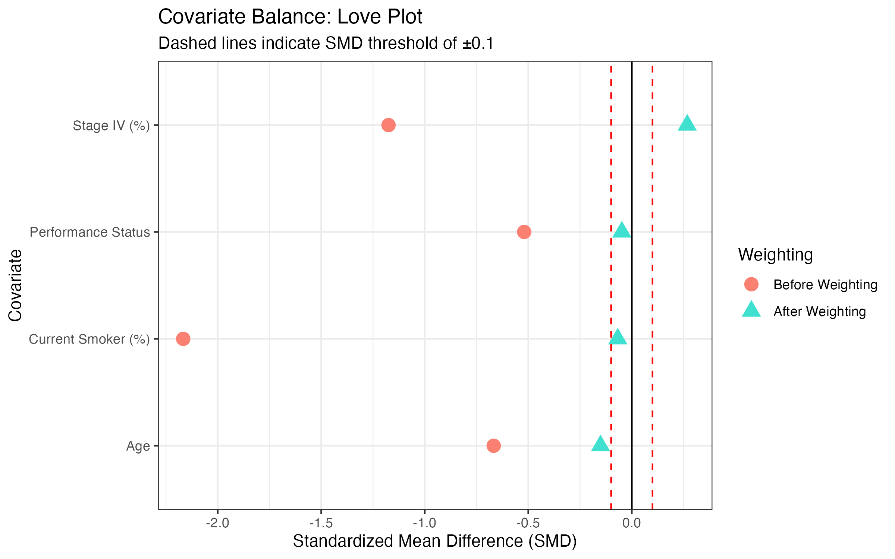
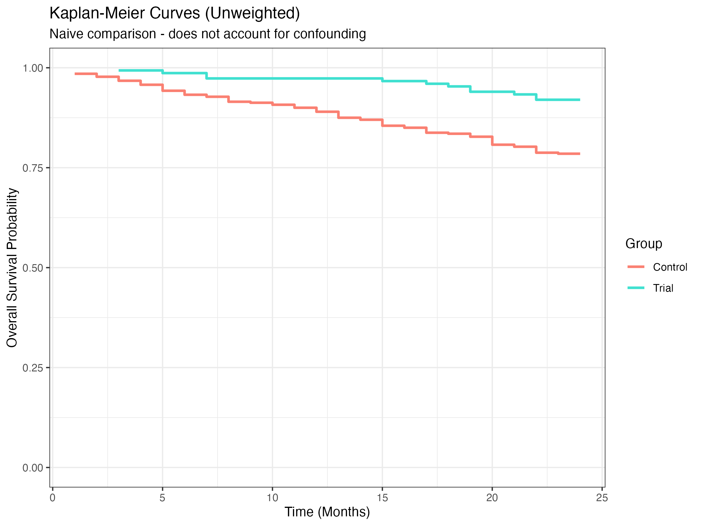
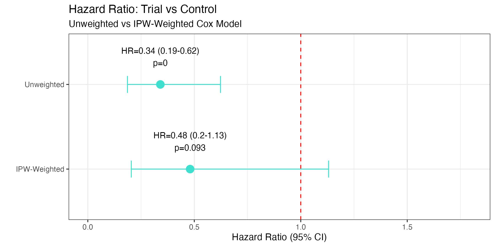

# 🫁 NSCLC External Control Arm (ECA) Study

### Simulated Real-World Evidence Study Using Inverse Probability Weighting

---

## 📌 Overview

This project simulates an **External Control Arm (ECA)** analysis for a single-arm 
immunotherapy trial in Non-Small Cell Lung Cancer (NSCLC).

A key challenge in single-arm oncology trials is the lack of a concurrent control group. 
This project demonstrates how **real-world observational data** can serve as an external 
control, and how **Inverse Probability Weighting (IPW)** can be used to adjust for 
confounding between trial and real-world populations.

---

## 📊 Study Design

- **Design:** Simulated single-arm trial vs external real-world control cohort
- **Trial group:** 150 NSCLC patients receiving novel immunotherapy
- **Control group:** 400 real-world NSCLC patients
- **Outcome:** Overall survival (months)
- **Predictors:** Age, cancer stage, performance status, smoking history

---

## 📐 Methods

1. **Data Simulation** — Clinically plausible NSCLC cohorts with intentional baseline 
differences to simulate real-world confounding
2. **Propensity Score Estimation** — Logistic regression model predicting probability 
of trial participation
3. **Inverse Probability Weighting (IPW)** — Weights applied to balance baseline 
characteristics between groups
4. **Covariate Balance Assessment** — Standardized Mean Differences (SMD) before 
and after weighting
5. **Cox Proportional Hazards Regression** — Unweighted and IPW-weighted survival 
models compared
6. **Visualization** — Love plot, Kaplan-Meier curves, forest plot

---

## 🔑 Key Findings

- **Before adjustment:** Trial group appeared 66% less likely to die (HR = 0.34, p < 0.001)
  — driven largely by healthier patients being selected into the trial
- **After IPW adjustment:** Treatment effect attenuated to HR = 0.48 (p = 0.093),
  reflecting true signal after removing confounding
- **IPW successfully balanced** all four covariates between groups (SMD < 0.1 after 
weighting)
- Demonstrates why **naive comparisons in ECAs are misleading** without proper 
bias adjustment

---

## 📈 Key Figures

### Love Plot — Covariate Balance


### Kaplan-Meier: Unweighted (Naive)


### Kaplan-Meier: IPW-Weighted (Adjusted)


### Forest Plot — HR Comparison


---

## ⚠️ Limitations

- Simulated dataset — not real patient data
- IPW can produce unstable weights with extreme propensity scores
- Unmeasured confounding cannot be addressed by IPW
- Simplified survival assumptions

---

## 🛠️ Tools Used

- R
- survival
- ggplot2
- dplyr
- tidyr

---

## 👩‍💻 Author

**Marianna Wicks, MPH, ODS, CRC** Precision Medicine | Oncology Data | Biostatistics

---

## ⭐ Key Skills Demonstrated

- External Control Arm (ECA) methodology
- Inverse Probability Weighting (IPW)
- Propensity score analysis
- Bias mitigation in real-world evidence studies
- Cox proportional hazards regression
- Survival analysis and visualization
- Reproducible research workflow in R

---

## ▶️ How to Run

1. Clone the repository
2. Open in RStudio
3. Set working directory to project root
4. Run scripts in order:

```r
source("scripts/01_data_sim.R")
source("scripts/02_propensity_score.R")
source("scripts/03_survival_analysis.R")
source("scripts/04_visualizations.R")
```
